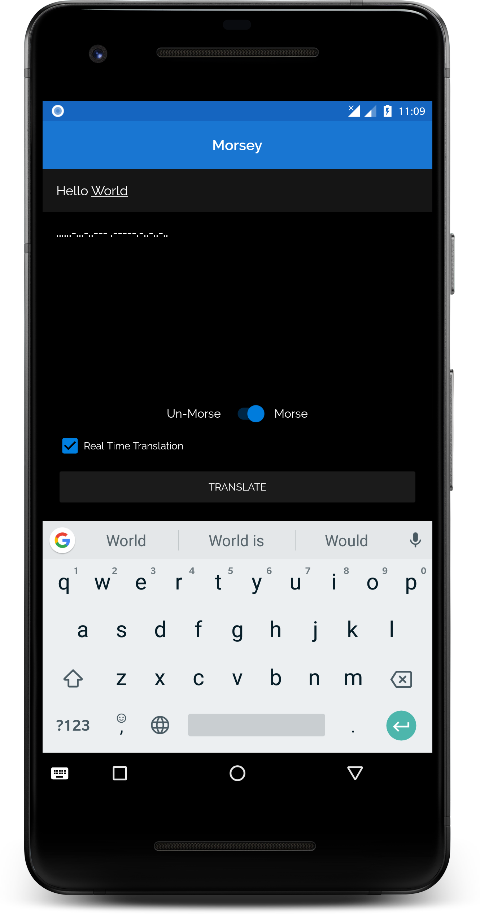
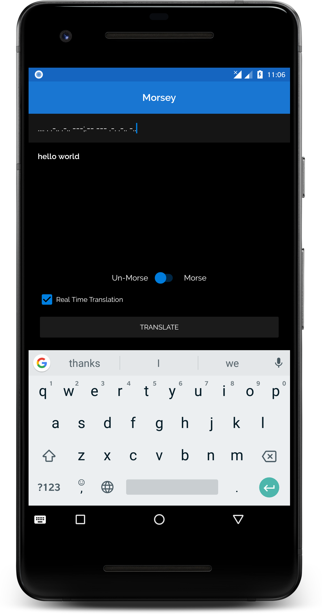

Morsey
========================
[  ](https://bintray.com/onwa1kenobi/Morsey/morsey/_latestVersion)

An Android library to translate to and from morse code.


Usage
-----

A simple `Morse` translation can be accomplished by calling the static method on the `Morsey` class 
and passing the string to be translated:
```kotlin
val translation = Morsey.morse("Hello World")
```

For reverse translation; which is to convert from `Morse` code to plain English, delimiters are required.
One to separate characters, and another to separate words. By default, `Morsey` uses a single whitespace
character `" "` to separate morse characters, and a semi-colon `";"` to separate words. You can also
specify your own delimiters. 
A simple `UnMorse` translation can be accomplished by calling the static method on the `Morsey` class 
and passing the string to be translated:
```kotlin
val translation = Morsey.unMorse(".... . .-.. .-.. ---;.-- --- .-. .-.. -..")
```
or
```kotlin
val translation = Morsey.unMorse(".... . .-.. .-.. --->.-- --- .-. .-.. -..", " ", ">")
```
Notice the delimiters.

Further enhancement is the `RealTime` translation. To achieve this, an instance of the `Morsey` class is 
required and then simply call the relevant method on the instance, depending on the usage.
```kotlin
val morsey = Morsey()
morsey.morseRealTime(inputField, outputLabel)
```
and
```kotlin
val morsey = Morsey()
morsey.unMorseRealTime(inputField, outputLabel)
```
`inputField` refers to the `EditText` that takes in the input to be translated, while `outputLabel` refers to
the `TextView` that shows the translated output. The sample app images shown give instances of usage.

 

The `EditText` listener can be unregistered by simply calling
```kotlin
morsey.unregisterMorsey(inputField)
```


Download
--------

Grab via [Maven]:
```xml
<dependency>
  <groupId>io.jul.morsey</groupId>
  <artifactId>morsey</artifactId>
  <version>1.0.0</version>
</dependency>
```
or [Gradle]:
```groovy
implementation 'com.jul.morsey:morsey:1.0.0'
```


License
=======

    Copyright 2018 Ugochukwu Ameh

    Licensed under the Apache License, Version 2.0 (the "License");
    you may not use this file except in compliance with the License.
    You may obtain a copy of the License at

       http://www.apache.org/licenses/LICENSE-2.0

    Unless required by applicable law or agreed to in writing, software
    distributed under the License is distributed on an "AS IS" BASIS,
    WITHOUT WARRANTIES OR CONDITIONS OF ANY KIND, either express or implied.
    See the License for the specific language governing permissions and
    limitations under the License.


 [1]: https://kotlinlang.org/docs/reference/coroutines.html
